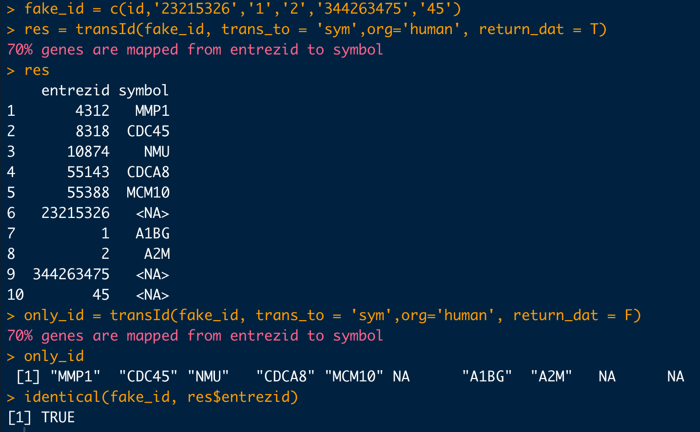
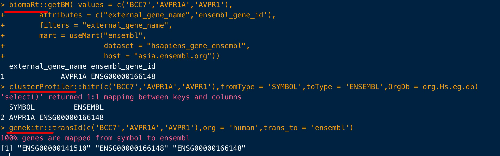
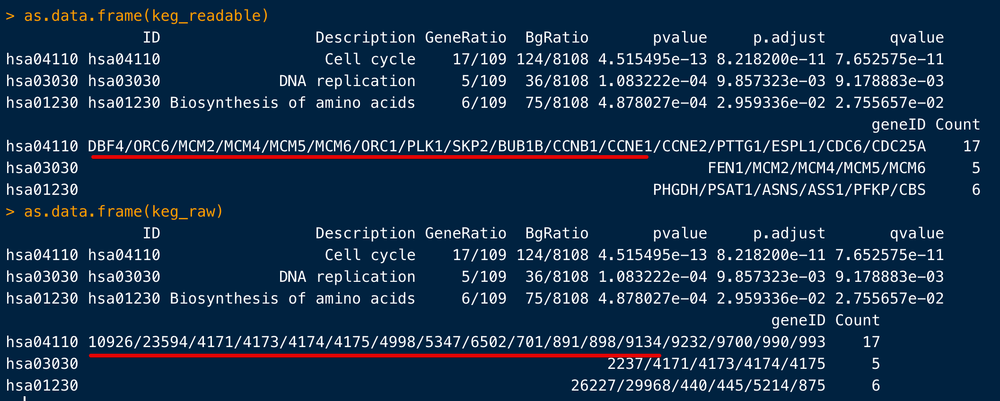
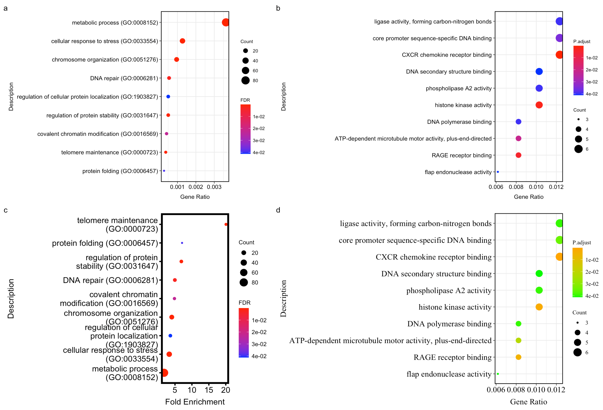
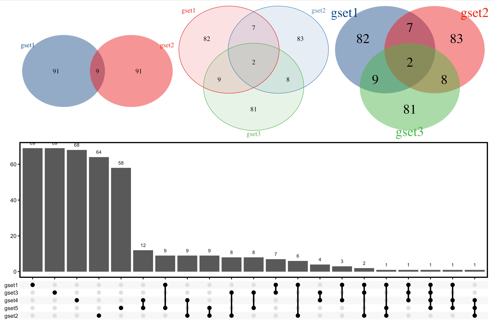
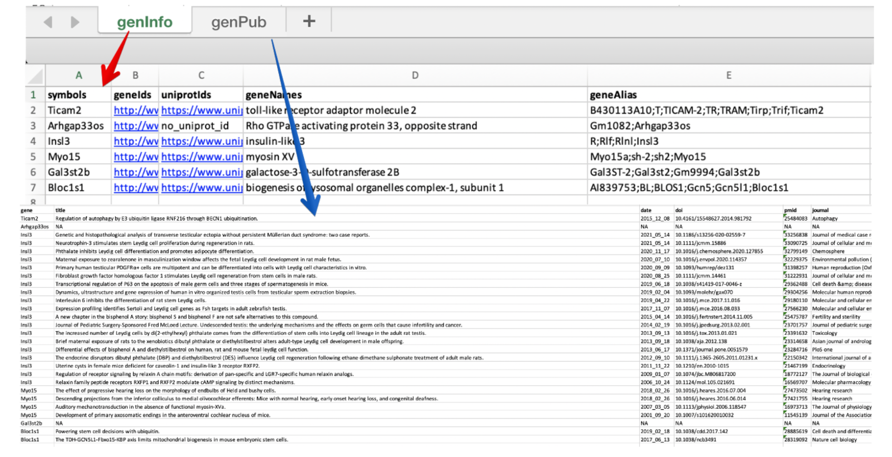

# genekitr: Gene Analysis Toolkit in R

> This tool annotates genes with alias, symbol, full name, function also related papers.
>
> 目的就是：与基因id相关的操作（如转换、可视化交集等）、分析（如富集分析），都可以加进来（后期考虑加入网页版）

## Table of Contents

-   [Installation](#installation)
-   [Features](#features)
-   [Plans](#plans)
-   [Debug](#debug)
-   [Let's mining data!](#lets-mining-data)
-   [Let's plot!](#lets-plot)
-   [Export](#export)

## Installation

You can also install devel version of **genekitr** from github with:

``` r
# install.packages("remotes")
remotes::install_github("GangLiLab/genekitr")
```

If you want to build vignette in local, please add two options:

``` r
remotes::install_github("GangLiLab/genekitr", build_vignettes = TRUE, dependencies = TRUE)
```


## Features

#### 信息获取 (Search)

- genecards虽然全，但是搜索数量有限制，于是整合了Ensembl 数据库和 `orgdb`中的基因信息 => `genInfo`

  - 与Ensembl数据库保持同步，做了`biomart`的数据接口，可以扩展其中各种数据（序列数据由于太长，不支持该函数直接显示；会有相应的序列函数去获取）
  - 保证返回结果与输入的id是一一对应的，即使没有结果也会用NA填充（即使输入的symbol是gene alias，也能拿到对应的标准symbol name）
  - 只有Entrez ID 才是唯一的（因此可能出现：一个entrez对应多个symbol、多个ensemble、多个uniprot，但一般第一个或者数值最小的entrez id才是最常使用的）
  - 对human、mouse、rat使用最全的uniprotKB数据（比ensemble数据库还新）
- 整合了相关的文献信息，可以自定义搜索关键词 => `genPubmed` 

#### 数据整理与转换（Tidy & Trans）

- 基因ID转换 => `transId`  
  - 支持`one-to-one match`  以及 `one-to-many match` 两种模式
  - `one-to-one` ：【id顺序优先级高于数量】提供id及要转换的类型，给出最合适的等长度的id，方便用户直接新增列（比如masspec数据我们想知道每一个uniprot id对应什么基因，一对一模式直接满足新增列）；我们给到的转换id也不是随意挑选的，而是先看`genInfo`的返回信息中NA最少的，如果NA数量一致，再看entrez id最小的（参考entrez id的编排意义）
    => 返回字符串
  - `one-to-many` ：【数量优先级高于顺序】比如想要对基因id进行富集分析，就需要尽可能多的id，需要用到一对多的模式，只要能匹配的我们都要
    => 返回数据框
  - 默认不进行`na.omit`，目的是让用户方便知道哪些基因没有match上

#### 数据分析（Analyse）

- 有了基因的id和对应的logFC（需要排序好），就可以做GSEA => `genGSEA`
- 有了基因id，就能做GO分析 => `genGO ` 
- 有了基因id，就能做KEGG分析 => `genKEGG`
  - 自己拿基因去做富集分析结果为数据框，并且新增一列：`FoldEnrich`
  - 拿网页结果，依然可以调整为特定格式 => `as.enrichdat`

#### 可视化（Visualize）

- 气泡图 => `plotEnrichDot ` 
- 交集韦恩图 =>`plotVenn` 

#### 导出结果 (Export)

- 每个操作都能得到一个数据框，可以继续探索，也可以作为不同的sheets导出到同一个excel => `expo_sheet`


## Plans

##### 信息获取 (Search)

- [x] `genInfo` 的`orgdb`数据根据每个物种保存为rda，以便快速加载【总共支持12种bioconductor org】

- [x] `genInfo` 输入name是gene alias：如果有对应的symbol，那么symbol列就写输入的name，其他列用标准symbol对应的列；如果没有对应的alias，那么其他列就是NA

- [x] `genInfo`增加基因位置 【之前通过下载分析GTF，但现在用`biomart`接口更快更方便】

- [ ] `genInfo`支持多个不同版本的基因组 => 可以参考`liftover`  （另外ensembl也有REST API：https://rest.ensembl.org/documentation/info/assembly_map）

- [x] `genInfo`与biomart的融合

  同时也发现**一个很有趣的事情**：标准命名人类的HGNC和小鼠的MGI都是以Ensembl数据库中的alias为准，而genecards用的是ncbi gene数据库的alias，为啥呢？其实看它们的创建国就知道了：GeneCards，是由以色列威兹曼研究院和美国Lifemap 生物科技有限公司；HGNC是EBI和剑桥大学联合；MGI是Jackson Lab，位于美国，但它比较倾向于Ensembl

  不过这两个我都加入了`genInfo`中，分别是`ensembl_alias` 和`ncbi_alias` 

- [ ] 可以增加基因以及对应蛋白的序列 => `genSeq` ?

- [ ] `auto_install`增加镜像选择

- [x] 目前`ensembl`数据库的uniprot id 不全，需要使用uniprot的数据把gene 和 protein id联系起来
  (例如小鼠的`P41234`这个Uniprot ID，在`ensemble`和`orgdb`中都不全，只有用uniprot数据才可以; 
  再如`Q6P2L7` 这个ID，有的MasSpes数据中将它转为`Casc4` 基因，但是Uniprot官网是`Golm2` ，这里我们的可以和官网保持一致，并且可以比常规MasSpes数据的基因id更丰富)

##### 数据整理与转换（Tidy & Trans）

- [x] ID转换`transId` 允许错误的id匹配，结果为NA，并且提交的顺序和结果的顺序一致
- [x] 从`genInfo`的结果中提取转换后的id，更快更准确，并且可以保证output和input顺序一致
- [x] 加快大型数据的ID转换速度，需要改进`genInfo`  脚本的`75-92`行代码=》重新写了`genInfo` 和`transId`代码，重新思考了两种不同id转换模式的应用场景  

##### 数据分析（Analyse）

- [x] 设置自己的示例数据，like：`data(geneList, package="genekitr")`
  数据来自`airway` ，使用`DESeq2`进行差异分析
- [x] 富集分析先将基因id全部转成entrez id，然后再根据需要利用 `transId()`  进行转换，达到`setReadable`的目的

##### 可视化（Visualize）

- [x] 增加genVenn，先做成数据框结果。然后如果多于五组比较，就做成usetplot图
- [x] 图片的y轴label折叠（比如dotplot的y轴有很多的term，且长度不一，如果出现太长的term，最好可以折叠一下）=> `strwrap()`
- [x] 设定特定的作图格式，比如dotplot可以支持任何网站的结果，只要满足我们的作图格式`as.enrichdat`
- [ ] 可视化GSEA结果

##### 导出结果 (Export)

- [ ] ~~图片也能导入excel（后期再看看这个有没有意义）~~
- [ ] ~~想到一个R包名称：`genepedia` （看看以后会不会使用它）~~
- [x] 设置了一个文件上传下载的服务器，示例数据可以直接存在其中，而不用占用`data`目录的空间
- [ ] ~~`expoSheet`的帮助示例添加管道操作，演示多个数据集的导出那个~~
- [x] `expoSheet` 参数接收list 的数据集和名称，取代之前的管道操作


## DEBUG

- [x] `genGO`的use_symbol参数不管用 （原因：如果提供的已经是symbol，那么就忽略了这个参数）

- [x] 函数正常使用，但是帮助文档出不来（原因：写完函数忘记`devtools::document()` ，跳过这一步直接刷新包就会导致文档没更新）

- [x] 一个symbol对应多个entrez时，会默认按照数值从小到大排序，然后再进行合并。因为同一个symbol name，数值比较小的entrez更常用

- [x] 更新了`genInfo` 和`transID` ，增加参数`simple = TRUE` ，方便应对一个id同时存在多个match结果的情况（如果`simple = TRUE` 就返回和input id 同样顺序的结果；如果`simple = F` ，就返回所有结果）

- [ ] `biomart`的结果也不全？发现`ENSG00000002079`[这个基因](http://asia.ensembl.org/Homo_sapiens/Gene/Summary?db=core;g=ENSG00000002079;r=7:99238829-99311130)在ensembl中对应基因`MYH16` ，但是biomart的结果中`ENSG00000002079 ` 没有对应，而且`MYH16` 对应的ensemble id也是NA

  - 解决方法1：尝试下载ensemble物种所有的mapping数据：

    ```xml
    # 以human为例，下载ensembl、symbol、uniprot的对应
    wget -O result.txt 'http://www.ensembl.org/biomart/martservice?query=<?xml version="1.0" encoding="UTF-8"?><!DOCTYPE Query><Query  virtualSchemaName = "default" formatter = "TSV" header = "0" uniqueRows = "0" count = "" datasetConfigVersion = "0.6" ><Dataset name = "hsapiens_gene_ensembl" interface = "default" ><Attribute name = "ensembl_gene_id" /><Attribute name = "hgnc_symbol" /><Attribute name = "uniprotswissprot" /></Dataset></Query>'
    ```

    


## Let's mining data!

#### Example gene ID

```R
mm_id =c('Ticam2
Arhgap33os
Insl3
Myo15
Gal3st2b
Bloc1s1') 
mm_id=str_split(mm_id,"\n")[[1]]
```

#### Method 1: All things about gene ID

- **AUTO** detect orgnism name (e.g. `human/hs/hg`  is fine)
  - support 12 organisms (maybe more in the future...)
- **AUTO** detect duplicate ID, ID alias or **even wrong spelled** ID
- Make sure the input order is identical with the output rownames

```R
# in this example, BCC7 is the alias of TP53; SXHFJG is a fake name
hg_id = c("MCM10",  "CDC20",  "S100A9", "FOXM1",  "KIF23",  "MMP1",   "CDC45",  "BCC7" ,  "SXHFJG", "TP53"  )
genInfo(hg_id, org = 'human')
```


Next, let's test mouse id:

```R
# here, some mouse id are not standard name, like histone genes (H1-0, H1-1...)
# but we can still get matched standard symbol name
# Besides, we add two fakegenes to test the robustness
mm_id = c("Gtpbp4", "Gtpbp8", "Gtse1" , "Gys1","H1-0", "H1-1" ,"H1-2" ,"H1-3" ,"Fakegene1","H1-4",
          "H1-5" ,"H1-6","H2ac21","H2ax","H2az2","Fakegene2")
genInfo(mm_id, org = 'mouse')
```




#### Method 2: Search pubmed 

```R
test2=genPubmed(mm_id, keywords = 'stem cell', field = 'tiab')
# Search example: Ticam2 [TIAB] AND stem cell [TIAB] 

# or use much specific keyword
genPubmed(mm_id, keywords = 'stem cell AND epithelial', field = 'tiab')
```


#### Method 3: GSEA

- ~~之前的操作~~

  ```R
  # 加载示例数据
  data(geneList, package="DOSE")
  # 获得msigdb的gene set
  msigdb <- getMsigdb(org='human', category='C3',subcategory = 'TFT:GTRD')
  # 直接进行gsea
  egmt <- genGSEA(genelist = geneList,geneset = msigdb)
  # 如果是extrez id，可以用下面的函数将id变成symbol
  egmt2 <- DOSE::setReadable(egmt, OrgDb = org.Hs.eg.db, keyType = 'ENTREZID')
  ```

- 目前已经将`getMsigdb` 整合进`genGSEA `， 和GO、KEGG一样，提供一个物种名称即可，比如人类可以是`human/hs/hsa/hg`
  并且和GO、KEGG一样，增加了`use_symbol`参数

```R
# 加载示例数据
data(geneList, package="DOSE")
# 直接进行gsea
genGSEA(genelist = geneList,org = 'human', category='C3',subcategory = 'TFT:GTRD',use_symbol = F)
```


#### Method 4: GO

- 函数需要用到物种的`org.db`，**如果没有相关物种注释包**，函数内部的`auto_install()` 会帮助下载👍
- `use_symbol = T` will return symbol id, otherwise return input id type

```R
data(geneList, package="DOSE")
id = names(geneList)[1:100]
ego = genGO(id, org = 'human',ont = 'mf',pvalueCutoff = 0.05,qvalueCutoff = 0.1 ,use_symbol = T)
```


**不知道物种名称？别怕！**

```R
biocOrg_name()
# full_name short_name
# 1   anopheles         ag
# 2      bovine         bt
# 3        worm         ce
# 4      canine         cf
# 5         fly         dm
# 6   zebrafish         dr
# 7    ecolik12      eck12
# 8  ecolisakai    ecSakai
# 9     chicken         gg
# 10      human         hs
# 11      mouse         mm
# 12     rhesus        mmu
# 13      chipm         pt
# 14        rat         rn
# 15        pig         ss
# 16    xenopus         xl
```


#### Method 5: Transform gene id

> Get 1-vs-1 matched id, even input gene is alias, duplicated or even WRONG!
> User just need to get the output (character) to do other analysis (exp. enrichment analysis)

- `org` support many species from `biocOrg_name()` 
  - support common name (e.g. `human/hs/hg`, `mouse/mm`, `dm/fly`) ...
- **AUTO detect** input gene id type
- Gene **ORDER** of output and input is **IDENTICAL**!

```R
library(AnnoGenes)
data(geneList, package = 'DOSE')
id = names(geneList)[1:5]
id
# "4312"  "8318"  "10874" "55143" "55388"

## ANY organism alias name and ANY trans_to argument name (exp. "ens", "ensem", "ensembl" are ok to function)
transId(id, trans_to = 'symbol',org='hs')
transId(id, trans_to = 'uni',org='human')
transId(id, trans_to = 'ens',org='hg')
```


If there are some ID could not transform to another type (like "type ERROR ID", "entrez ID has NO matched id"), the output will show as NA, while **still keep the same order** with the input

```R
# the id "23215326", "344263475" and "45" are fake, while others are real
fake_id = c(names(geneList)[1:5], '23215326','1','2','344263475','45')

# the gene order of output and input is identical!
transId(fake_id, trans_to = 'sym',org='human')
# 70% genes are mapped from entrezid to symbol
# [1] "MMP1"  "CDC45" "NMU"   "CDCA8" "MCM10" NA      "A1BG"  "A2M"   NA      NA 
```

However, if user provides **wrong orgnism,** the function will report error...

```R
## try to trans human id to symbol, but choose wrong org (mouse)
transId(id, trans_to = 'sym',org='mouse')
# Error in .gentype(id, org) : Wrong organism! 
```

Compare `genekitr::transId` and `clusterProfiler::bitr`

> 保留原始id顺序，而没有去除NA，就是为了方便用户看到哪些ID没有转换成功；
> 如果用户后面需要去掉NA，那么直接使用`na.omit()`即可

```R
fake_id = c(names(geneList)[1:5], '23215326','1','2','344263475','45')
res1 = transId(fake_id, trans_to = 'sym',org='human')
res2 = clusterProfiler::bitr(fake_id, fromType = 'ENTREZID',
                      toType = 'SYMBOL', OrgDb = org.Hs.eg.db)
```


Change another organism:

```R
library(org.Dm.eg.db)
id = toTable(org.Dm.egSYMBOL) %>% dplyr::pull(1) %>% sample(20)
transId(id, trans_to = 'ens',org='fly')
transId(id, trans_to = 'symbol',org='fly')
```


不管是参数的简洁，还是结果的准确性，都胜过其他两大R包`clusterProfiler::bitr` 和`biomaRt::getBM`：



#### Method 6: KEGG

```R
ids = names(geneList)[1:100]
gkeg <- genKEGG(ids, org = 'human') 
# org可以是common name（如human、mouse），也可以是hg、hs等常见的称呼

# 默认支持readable 参数，结果以symbol name展示
keg_raw <- genKEGG(test, org = 'hs', use_symbol = F)
keg_readable <- genKEGG(test, org = 'hs', use_symbol = T)
# 差别就是：
```




换个物种试试~理论上，**拿任意物种的symbol、entrez、ensembl基因，给函数投食即可**。不需要再提前进行id转换了

```R
# 小鼠基因为例
head(id)
[1] "Adora1"    "Insl3"    "AF067061"      "Alpk1"         "Arhgap20"      "B020004J07Rik" "Bmp6"
keg <- genKEGG(mm_id, org = 'mouse', use_symbol = T, pvalueCutoff = 1, qvalueCutoff = 1, maxGSSize = 3000)
```


## Let's plot!

#### P1: Enrichment dotplot =>  `plotEnrichDot ` 

- 默认按照 `FoldEnrich + p.adjust`
- 目前可以将大多数富集分析结果转换为作图需要的数据框：`as.enrichdat` 
  - 支持R包：clusterP
  - 支持网页：[panther](http://geneontology.org/)、
- 支持定义主图和legend的字体及大小；是否去除网格线、文字、图例；自定义渐变色的顶部和底部颜色；设定x轴起点；折叠y轴title；边框和刻度线宽度

```R
# First, feed any dataframe result to enrichDat 
test = as.enrichDat(test)
ego = as.enrichDat(ego)

# Second, easy plot
p1 = plotEnrichDot(test,legend_by = 'qvalue'))
p2 = plotEnrichDot(ego)

# Third, if you want to change more on plot...
# test dataframe was from GeneOntology panther web result
p3 = plotEnrichDot(test, xlab_type =  'FoldEnrich', legend_by = 'qvalue',
              show_item = 15, main_text_size = 14,legend_text_size = 10,
              low_color = 'red', high_color = 'blue',
              xleft = 0, font_type = 'Arial', remove_grid = T,
              wrap_width = 30,border_thick = 3 )

# ego dataframe was from clusterP result
p4=plotEnrichDot(ego, xlab_type =  'GeneRatio', legend_by = 'p.adjust',
                 show_item = 10, main_text_size = 14,legend_text_size = 10,
                 low_color = 'orange', high_color = 'green',
                 xleft = 0, font_type = 'Times New Roman', remove_grid = F,
                 wrap_width = NULL ,border_thick = 1)

library(patchwork)
wrap_plots(list(p1,p2,p3,p4))+ plot_layout(ncol = 2) + 
  plot_annotation(tag_levels = 'a')
```




#### P2: Venn plot =>  `plotVenn ` 

- 如果venn_list的长度大于4，那就默认使用`UpSet plot`；否则使用常规的venn plot
- venn plot可以调整：透明度、字体大小、边框粗细/有无、颜色
- upset plot可以调整：字体大小、边框粗细、内部网格线

```R
library(AnnoGenes)
library(dplyr)
library(patchwork)

set1 <- paste(rep("gene" , 100) , sample(c(1:1000) , 100 , replace=F) , sep="")
set2 <- paste(rep("gene" , 100) , sample(c(1:1000) , 100 , replace=F) , sep="")
set3 <- paste(rep("gene" , 100) , sample(c(1:1000) , 100 , replace=F) , sep="")
set4 <- paste(rep("gene" , 100) , sample(c(1:1000) , 100 , replace=F) , sep="")
set5 <- paste(rep("gene" , 100) , sample(c(1:1000) , 100 , replace=F) , sep="")

two_gene_list = list(gset1 = set1, gset2 = set2)
sm_gene_list = list(gset1 = set1, gset2 = set2, gset3 = set3)
la_gene_list = list(gset1 = set1, gset2 = set2, gset3 = set3, gset4 = set4, gset5 = set5 )

p1 = plotVenn(two_gene_list, alpha_degree = 1, border_thick = 0)

p2= plotVenn(sm_gene_list,alpha_degree = .3, border_thick = 1)
p3 = plotVenn(sm_gene_list,text_size = 2,alpha_degree = 1,
              remove_grid = T, color = ggsci::pal_lancet()(3))

p4 = plotVenn(la_gene_list,use_venn = F,
              text_size = 10, border_thick = 2,remove_grid = T)

(p1+p2+p3)/p4
```




## Export

- support list of datasets with different sheet names

```R
library(openxlsx)
expoSheet(dat_list =  list(mtcars,ToothGrowth,iris), name_list = list('mtcars','tooth','IRIS'),
  filename = 'test.xlsx')
```




## References

### Things about GSEA

- https://www.biostars.org/p/132575/
- https://www.biostars.org/p/367191/
- https://www.gsea-msigdb.org/gsea/doc/GSEAUserGuideFrame.html

