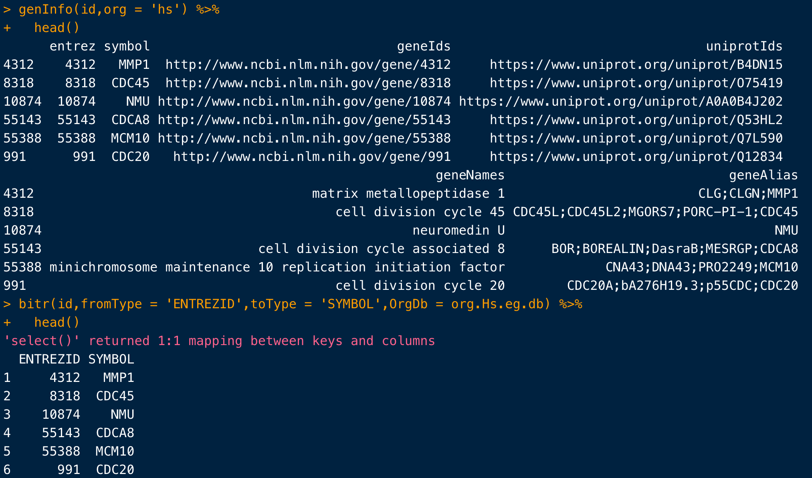

# Annotate genes 

> This tool annotates genes with alias, symbol, full name, function also related papers.
>
> 目的就是：与基因id相关的操作（如转换、可视化交集等）、分析（如富集分析），都可以加进来（后期考虑加入网页版）

### Features

- genecards虽然全，但是搜索数量有限制，于是整合了基因信息 =>`genInfo`
- 整合了相关的文献信息，可以自定义搜索关键词 => `genPubmed` 
- 每个操作都能得到一个数据框，可以继续探索，也可以作为不同的sheets导出到同一个excel => `expo_sheet`
- 有了基因的id和对应的logFC（需要排序好），就可以做GSEA => `getMsigdb +  genGSEA`
- 有了基因id，就能做GO分析 => `genGO`

### Plans

- ~~图片也能导入excel（后期再看看这个有没有意义）~~
- 基因的KEGG注释【over-representation analysis (ORA)】
- 增加genVenn，先做成数据框结果。然后如果多于五组比较，就做成usetplot图

- genInfo增加基因位置，并且支持多个不同版本的基因组

### Let's do it!

#### example gene id

```R
id =c('Ticam2
Arhgap33os
Insl3
Myo15
Gal3st2b
Bloc1s1') 
id=str_split(id,"\n")[[1]]
```


#### Method1: gene alias, full name

```R
test1 = genInfo(id, org = 'mm')
```

rownames of `test1` are entrez ID


#### Method2: search pubmed 

```R
test2=genPubmed(id, keywords = 'stem cell', field = 'tiab')
# Search example: Ticam2 [TIAB] AND stem cell [TIAB] 

# or use much specific keyword
genPubmed(id, keywords = 'stem cell AND epithelial', field = 'tiab')
```


#### Method3: GSEA

```R
# 加载示例数据
data(geneList, package="DOSE")
# 获得msigdb的gene set
msigdb <- getMsigdb(org='human', category='C3',subcategory = 'TFT:GTRD')
# 直接进行gsea
egmt <- genGSEA(genelist = geneList,geneset = msigdb)
# 如果是extrez id，可以用下面的函数将id变成symbol
egmt2 <- DOSE::setReadable(egmt, OrgDb = org.Hs.eg.db, keyType = 'ENTREZID')
```


#### Method4: GO

函数需要用到物种的`org.db`，如果没有相关物种注释包，函数内部的`auto_install()` 会帮助下载👍

```R
data(geneList, package="DOSE")
id = names(geneList)[1:100]
ego = genGO(id, org = 'human',ont = 'mf',pvalueCutoff = 0.05,qvalueCutoff = 0.1 ,readable = T)
head(ego)
tmp=as.data.frame(ego)
```


**不知道物种名称？别怕！**

```R
> biocOrg_name()
    full_name short_name
1   anopheles         ag
2      bovine         bt
3        worm         ce
4      canine         cf
5         fly         dm
6   zebrafish         dr
7    ecolik12      eck12
8  ecolisakai    ecSakai
9     chicken         gg
10      human         hs
11      mouse         mm
12     rhesus        mmu
13      chipm         pt
14        rat         rn
15        pig         ss
16    xenopus         xl
```


#### Method5: map gene id

- `org` support many from `biocOrg_name()`

- user can choose output dataframe or not, using `return_dat`

```R
mapId(id = ids, from = 'entrez', to = 'symbol',org='human', return_dat = T)
```


### This package is very easy!

- support pipe ` %>% ` 

```R
library(openxlsx)
wb <- createWorkbook()
wb <- expo_sheet(wb, sheet_dat = test1, sheet_name = 'genInfo') %>% 
  expo_sheet(., sheet_dat = test2, sheet_name = 'genPub') %>% 
saveWorkbook(wb, "~/Downloads/test.xlsx", overwrite = T)
```


- `genInfo` vs `bitr`

  