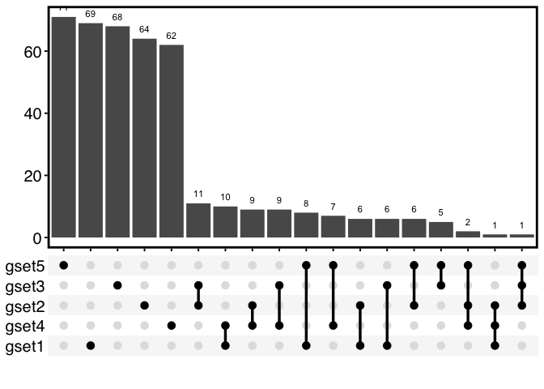
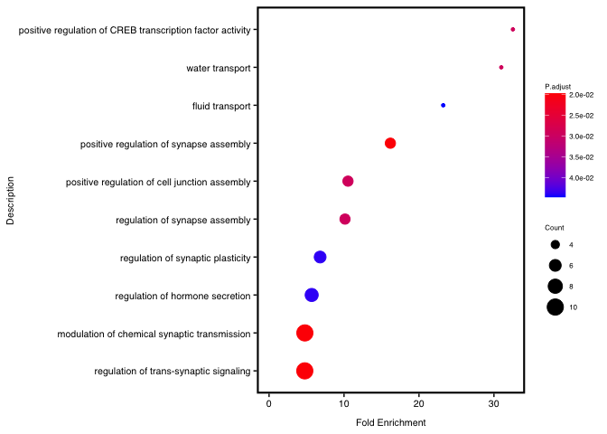
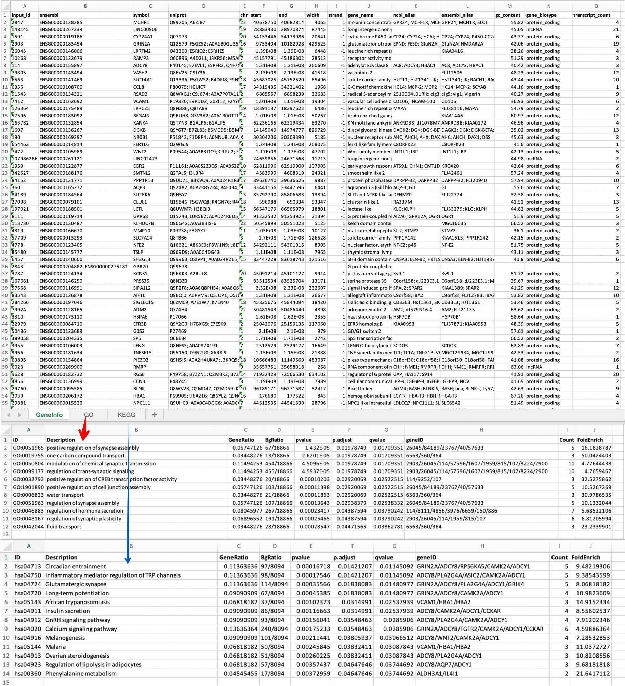

<!-- README.md is generated from README.Rmd. Please edit that file -->

# genekitr

**genekitr** is an R analysis toolkit based on the gene. It mainly
contains five features:

-   Search: Gene IDs as input then get gene-related information (exp.
    location, gene name, gene alias, GC content …) as well as search
    gene-related PubMed records

-   Transform: Transform gene ID type among “symbol”, “entrezid”,
    “ensembl” and “uniprot”

-   Analysis: Gene enrichment analysis including ORA (GO and KEGG) and
    GSEA

-   Visualize: Visualization for enrichment analysis and gene overlaps

-   Export: Gene IDs and analysis results could be exported as various
    sheets in one Excel file, which could be easily read and shared with
    others

**Why develop this R package?**

用户痛点：

-   ID转换不够全，很多gene alias 不能够被识别（比如huamn
    的BCC7实际对应TP53，mouse的Tp53实际可能对应Trp53, Trp53inp2 & Ano9）

-   参数设置不够友好，太繁琐（我们允许用户只输入基因id，至于它是symbol、entrez还是其他，函数可以自行判断）

-   保持和数据库的同步（ensembl、Uniprot），很多MassSpec数据中uniprot
    ID对应的symbol存在错误或者不完整，我们可以尽量减少

-   …

## Table of Contents

-   [Installation](#installation)
-   [Quick guide](#quick-guide)
-   [Vignette](#vignette)
-   [Citation](#citation)
-   [Welcome to contribute](#welcome-to-contribute)

## Installation

Install CRAN stable version:

``` r
install.packages("genekitr")
```

Install GitHub dev version:

``` r
# install.packages("remotes")
remotes::install_github("GangLiLab/genekitr")
# To build local vignette:
# remotes::install_github("GangLiLab/genekitr", build_vignettes = TRUE, dependencies = TRUE)
```

## Quick guide

To quickly go through the package usage, we will use built-in gene list
from GEO airway

([GSE52778](https://www.ncbi.nlm.nih.gov/geo/query/acc.cgi?acc=GSE52778))
DEG analysis.

### Search

##### Search gene related information

`org` argument could accept fullname or shortname of specific organism.
For example, we could

use `human/hs/hg` to describe human.

``` r
library(genekitr)
#> 
data(geneList)
id = names(geneList)[1:100]
head(id)
#> [1] "2847"   "148145" "1591"   "2903"   "26045"  "10268"
ginfo = genInfo(id, org = 'human')
dplyr::as_tibble(ginfo)
#> # A tibble: 100 × 15
#>    input_id ensembl  symbol uniprot  chr    start    end  width strand gene_name
#>    <ord>    <chr>    <chr>  <chr>    <chr>  <int>  <int>  <dbl>  <int> <chr>    
#>  1 2847     ENSG000… MCHR1  Q99705;… 22    4.07e7 4.07e7   4065      1 melanin …
#>  2 148145   ENSG000… LINC0… <NA>     19    2.89e7 2.90e7  87445      1 long int…
#>  3 1591     ENSG000… CYP24… Q07973   20    5.42e7 5.42e7  20541     -1 cytochro…
#>  4 2903     ENSG000… GRIN2A Q12879;… 16    9.75e6 1.02e7 429525     -1 glutamat…
#>  5 26045    ENSG000… LRRTM2 O43300;… 5     1.39e8 1.39e8   6448     -1 leucine …
#>  6 10268    ENSG000… RAMP3  O60896;… 7     4.52e7 4.52e7  28512      1 receptor…
#>  7 114      ENSG000… ADCY8  P40145;… 8     1.31e8 1.31e8 260609     -1 adenylat…
#>  8 79805    ENSG000… VASH2  Q86V25;… 1     2.13e8 2.13e8  41518      1 vasohibi…
#>  9 6563     ENSG000… SLC14… Q13336;… 18    4.57e7 4.58e7  65496      1 solute c…
#> 10 6355     ENSG000… CCL8   P80075;… 17    3.43e7 3.43e7   1968      1 C-C moti…
#> # … with 90 more rows, and 5 more variables: ncbi_alias <chr>,
#> #   ensembl_alias <chr>, gc_content <dbl>, gene_biotype <chr>,
#> #   transcript_count <int>
```

##### Search gene PubMed records

``` r
pub = genPubmed(
  id = c("Cyp2c23", "Fhit", "Gal3st2b","Insl3", "Gbp4"),
  keywords = "stem cell", field = "tiab")
#> Search example: Cyp2c23 [TIAB] AND stem cell [TIAB]
head(pub)
#>      gene
#> 1 Cyp2c23
#> 2    Fhit
#> 3    Fhit
#> 4    Fhit
#> 5    Fhit
#> 6    Fhit
#>                                                                                                                                                                          title
#> 1                                                                                                                                                                           NA
#> 2                                                                           Methylation status of the <i>FHIT</i> gene in the transformed human mesenchymal F6 stem cell line.
#> 3                                                                Totipotent stem cells bearing del(20q) maintain multipotential differentiation in Shwachman Diamond syndrome.
#> 4                                                                         Fhit-deficient hematopoietic stem cells survive hydroquinone exposure carrying precancerous changes.
#> 5 Induction by 7,12-dimethylbenz(a)anthracene of molecular and biochemical alterations in transformed human mammary epithelial stem cells, and protection by N-acetylcysteine.
#> 6                                                        [Expression of fragile histidine triad (FHIT) protein and its significance in diagnosing classical Hodgkin lymphoma].
#>         date                              doi     pmid
#> 1         NA                               NA       NA
#> 2 2020_10_01             10.3892/ol.2015.3092 26137124
#> 3 2009_02_20 10.1111/j.1365-2141.2008.07448.x 19016724
#> 4 2008_06_24    10.1158/0008-5472.CAN-07-5687 18483248
#> 5 2006_10_05                                  16865267
#> 6 2008_10_21                                  16777001
#>                                                      journal
#> 1                                                         NA
#> 2                                           Oncology letters
#> 3                             British journal of haematology
#> 4                                            Cancer research
#> 5                          International journal of oncology
#> 6 Zhonghua bing li xue za zhi = Chinese journal of pathology
```

### Transform

Regardless of input ID type, function will detect automatically.

User only need to specify which type you want, the left things just give
`transId`.

##### Transform ID from entrezid to symbol

``` r
head(id)
#> [1] "2847"   "148145" "1591"   "2903"   "26045"  "10268"
id2 = transId(id, trans_to = 'symbol',org='hs')
#> 
#> 100% genes are mapped from entrezid to symbol
head(id2)
#> [1] "MCHR1"     "LINC00906" "CYP24A1"   "GRIN2A"    "LRRTM2"    "RAMP3"
```

### Analysis

All enrichment analysis just give a gene list (especially GSEA need the
gene list with a decreasing fold change)

##### GO analysis

User could choose ontology among “bp”, “cc” or “mf”.

If set `use_symbol = TRUE`, the result will return gene symbol for
easily understand.

If you are not sure the organism name, please type `biocOrg_name` and
choose full name or short name

``` r
ego = genGO(id, org = 'human', ont = 'bp',pvalueCutoff = 0.05,qvalueCutoff = 0.05, use_symbol = T)
```

##### KEGG analysis

If you are not sure the organism name, please type `keggOrg_name` and
choose full name or short name

``` r
ekeg = genKEGG(id, org = 'hg',use_symbol = T)
```

##### GSEA analysis

`category` argument could choose from ‘C1’,‘C2’,‘C3’,
‘C4’,‘C5’,‘C6’,‘C7’,‘C8’ and ‘H’

If you are not sure `subcategory`, you can only choose `category` and
leave `subcategory` as blank.

The message will tell what options you could choose in the main
`category`.

``` r
egsea = genGSEA(genelist = geneList,org = 'hs', 
                category='C2',subcategory = 'CP:KEGG',
                use_symbol = T, pvalueCutoff = 0.01)
```

### Visulaize

##### Gene overlap

If we only have two or three groups of genes, the function will plot
Venn diagram;

If we have at least four groups of genes, the default option will be
UpSet diagram.

``` r
# if only have three groups
set1 <- paste0(rep("gene", 100), sample(c(1:1000), 100))
set2 <- paste0(rep("gene", 100), sample(c(1:1000), 100))
set3 <- paste0(rep("gene", 100), sample(c(1:1000), 100))
sm_gene_list <- list(gset1 = set1, gset2 = set2, gset3 = set3)
plotVenn(sm_gene_list,
  text_size = 1.5, alpha_degree = 1,
  remove_grid = TRUE)
#> Color length should be same with venn_list, auto assign colors...
```

<!-- -->

``` r
# if only have five groups
set4 <- paste0(rep("gene", 100), sample(c(1:1000), 100))
set5 <- paste0(rep("gene", 100), sample(c(1:1000), 100))
la_gene_list <- list(gset1 = set1, gset2 = set2, gset3 = set3,
  gset4 = set4, gset5 = set5)
plotVenn(la_gene_list,
  text_size = 15, alpha_degree = 0.2, border_thick = 2,
  remove_grid = TRUE, use_venn = FALSE)
```

<!-- -->

##### Enrichment barplot

User could choose “FoldEnrich”, “GeneRatio” or “Count” as x-axis label,
default is “FoldEnrich”.

``` r
plotEnrichBar(ego,remove_grid = T, main_text_size = 8,
  legend_text_size = 6,border_thick = 1.5)
```

<!-- -->

##### Enrichment dotplot

``` r
plotEnrichDot(ego,remove_grid = T, main_text_size = 8,
  legend_text_size = 6,border_thick = 1.5)
```

<!-- -->

### Export

If you want to export many data sets in one file, you could use
`expoSheet`

For example, since we got 100 genes’ GO and KEGG result, then we want to
export them with gene information:

``` r
expoSheet(
  dat_list = list(ginfo, ego, ekeg), name_list = list("GeneInfo","GO", "KEGG"),
  filename = "gene_enrich.xlsx", dir = tempdir())
```

The result will be:



## Vignette

### English

-   Wait to update…

### 中文区 (推文专区)

-   待更新1：R包搞定你的基因需求

## Citation

Wait for paper …

## Welcome to contribute

If you are interested in this tool, welcome contribute your ideas as
follows:

-   Git clone this project
-   Double click `genekitr.Rproj` to open RStudio
-   Modify source code in `R/` folder
-   Run `devtools::check()` to make sure no errors, warnings or notes
-   Pull request and describe clearly your changes
